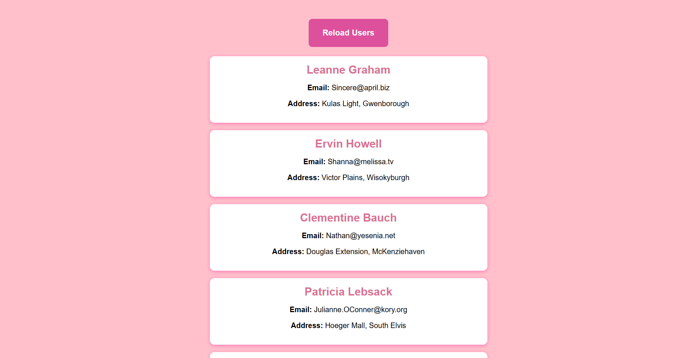

# User Data Fetcher

This is a simple web application that fetches user data from a public API and displays it using HTML, CSS, and JavaScript.

[Visit the site here](https://archiep27.github.io/JavaScript-FetchAPI-Demo/)

## Features

- Fetches user data from `https://jsonplaceholder.typicode.com/users`
- Displays each user's name, email, and address
- Styled using clean, responsive CSS
- Error handling with a user-friendly message
- Reload button to re-fetch user data
- Easy to test offline error behavior

## How to Use

1. Clone or download the project.
2. Open the `index.html` file in your web browser.
3. User data will be loaded automatically.
4. Click the **Reload Users** button to refresh the data.

## Testing Error Handling

To test the network error handling:

1. Disable your internet connection.
2. Click the **Reload Users** button.
3. An error message will be displayed indicating the failure to load data.

## File Structure

project/  
│  
├── index.html  
├── style.css  
├── script.js  
└── README.md  

## Technologies Used

- HTML5
- CSS3
- Vanilla JavaScript (ES6+)
- [JSONPlaceholder API](https://jsonplaceholder.typicode.com/)

## ℹ️ Note on Offline Error Handling

This app includes custom error handling using JavaScript’s `fetch().catch()` block. If the user is offline or there's a network failure, a user-friendly message is shown on the page.

However, **when deployed on GitHub Pages**, if the internet is disconnected:

- The browser may show a default "**No Internet Connection**" error page.
- This prevents the HTML and JavaScript from loading.
- As a result, the app’s custom error message will **not appear**.

### ✅ To properly test error handling:

To see the custom "Failed to load user data" error message:

1. **Download the project locally**
2. Open `index.html` in a browser
3. Disconnect from the internet
4. Click the **Reload Users** button

This ensures the page is already loaded, allowing the custom JavaScript error message to display correctly.

